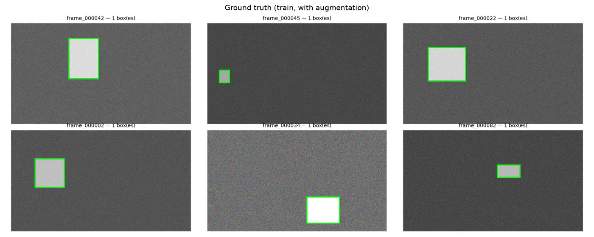
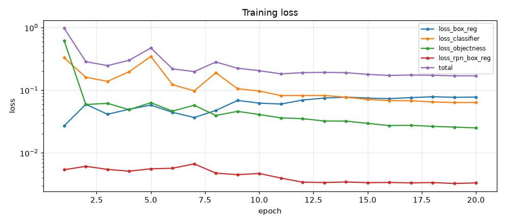
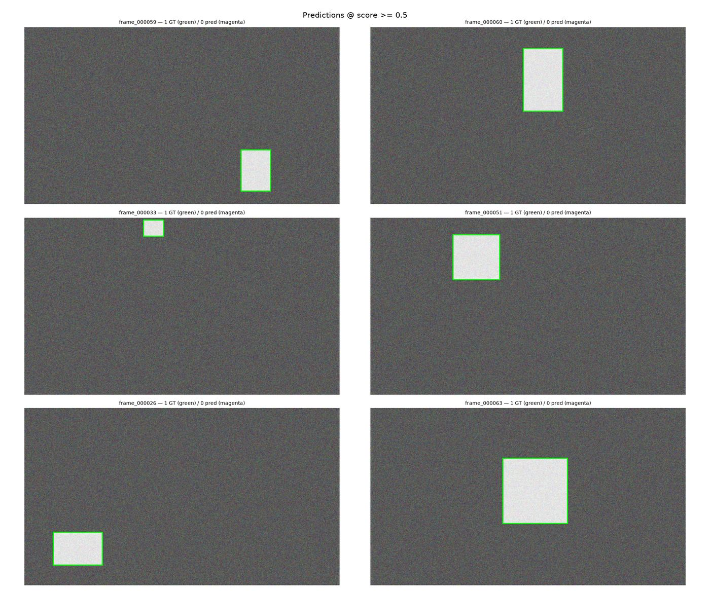

# Guided walkthrough — Steps 0–9

This is a hands-on companion to [`notebooks/local_train.ipynb`](../notebooks/local_train.ipynb).
The notebook has exactly ten top-level steps, numbered 0 through 9 — so "the first ten steps" is
the whole workflow, start to finish. Everything below was **actually executed in this repo**
against a small stand-in dataset (there's no real Omniverse Replicator scene wired up yet), so the
numbers, output, and images are real, not illustrative.

Read this alongside the notebook. Where the notebook explains *what* a cell does, this doc focuses
on *what you should notice* when you run it yourself.

## Before you start

```bash
source .venv/bin/activate          # already set up in this repo
cp .env.example .env               # every default is tuned for this machine
```

`data/raw/` and `data/kitti/` start empty — only `.gitkeep`. There's no Replicator scene generating
frames yet, so to actually exercise the pipeline (rather than just read about it) we need *some*
image+box data in the shape Replicator's `BasicWriter` produces. That's what Step 4 below is really
about.

---

## Step 0 — Prerequisites check

**What it does:** confirms the GPU is visible to PyTorch, *and* that the installed build actually
has a kernel for this specific GPU — `torch.cuda.is_available()` can return `True` on a machine
that will still crash the moment you launch a real kernel, if the build has no matching `sm_`
binary. The cell proves it by running an actual `Conv2d` forward + backward, not just checking the
flag.

**What we saw here:**

```
Platform    : Linux aarch64
torch       : 2.13.0+cu130
torchvision : 0.28.0+cu130
CUDA avail  : True
device      : NVIDIA GB10
capability  : sm_121
vram        : 131 GB
build archs : ['sm_80', 'sm_90', 'sm_100', 'sm_110', 'sm_120']
kernel test : OK (conv2d forward + backward)
```

**Notice:** `sm_121` isn't in `build archs`. That's fine — `sm_120` kernels run on `sm_121`
because they share a major architecture — but it's *only* fine because the kernel test above
passed. If it hadn't, `is_available()` would still have said `True`, and the first sign of trouble
would've been a cryptic `CUDA error: no kernel image is available` deep into Step 6. This is the
whole reason Step 0 exists as its own step instead of being folded into Step 1.

---

## Step 1 — Configuration

**What it does:** every path and hyperparameter downstream is read from this one cell (or from
`.env`, loaded first). Nothing later in the notebook hardcodes a value that isn't defined here.

**What we saw here:**

```
Project dir  : /home/as22cq/Projects/SyntheticDataGenerationModelTraining
Classes      : ['__background__', 'palletjack']
Image size   : 1280x720
Backbone     : resnet18
Batch/epochs : 16 / 20 @ lr=0.02
Device       : cuda  | AMP: True
```

**Notice:** `CLASSES = ["__background__", TARGET_CLASS]` — class index `0` is reserved for
background by every torchvision detection model. If you ever add a second object class, it goes
in at index 2, not 1. `TARGET_CLASS` must exactly match (lowercase) whatever semantic label your
Replicator scene assigns — get this wrong and Step 4 will silently produce zero boxes rather than
erroring, because the converter just treats an unrecognized label as "not the target class."

---

## Step 2 — Training environment

**What it does:** flips on the throughput knobs that matter for this GPU (TF32 matmuls, cuDNN
autotuning) and *measures* what the hardware actually delivers, rather than quoting a spec sheet
figure — that measurement is what makes the "estimated total training time" printed in Step 6
trustworthy.

**What we saw here:**

```
matmul fp32/tf32 : 36.0 TFLOP/s
matmul bf16      : 79.7 TFLOP/s
TF32 + cuDNN autotune enabled. AMP=on.
```

**Notice:** BF16 is roughly 2.2× TF32 on this part — that gap is most of where AMP's speedup comes
from in Step 6. `cudnn.benchmark = True` autotunes convolution algorithms for a *fixed* input size;
if your batches ever have varying image sizes, this setting works against you (it re-tunes on every
new shape instead of reusing a cached plan).

---

## Step 3 — Load a pre-trained detection backbone

**What it does:** builds Faster R-CNN on top of an ImageNet-pretrained ResNet-18 wrapped in a
Feature Pyramid Network (FPN), with `trainable_layers=3` — the earliest, most generic conv blocks
stay frozen; only the later, more task-specific ones fine-tune.

**What we saw here:**

```
model      : FasterRCNN + resnet18-FPN
classes    : 2 ['__background__', 'palletjack']
parameters : 28.3 M total, 28.1 M trainable
```

**Notice:** 28.1 of 28.3 M parameters are trainable — freezing the stem and stage 1 barely dents
the parameter count (it's shallow), but it still matters, because those frozen layers are the ones
most likely to latch onto renderer-specific artifacts in synthetic data if left unfrozen. The
`AnchorGenerator` defines one box size per FPN level (32, 64, 128, 256, 512 px) × three aspect
ratios — an object far outside that size range at every level simply won't get proposed, no matter
how much you train.

---

## Step 4 — Prepare the dataset

This is the step that needed real input to exercise. Since there's no Replicator scene here yet,
[`scripts/generate_toy_dataset.py`](../scripts/generate_toy_dataset.py) stands in for it: it writes
the exact `BasicWriter` layout the converter expects — `rgb_*.png` +
`bounding_box_2d_tight_*.npy` (structured array with `semanticId`/`x_min`/`y_min`/`x_max`/`y_max`/
`occlusionRatio`) + a labels JSON mapping semantic IDs to class names — just with a single bright
rectangle on noise standing in for a real rendered object.

```bash
python scripts/generate_toy_dataset.py --out data/raw --n 96
```

This writes 96 frames at 960×540 (deliberately *not* matching `IMAGE_WIDTH`×`IMAGE_HEIGHT`, so the
converter's resize/rescale path in 4.1 actually gets exercised instead of being a no-op).

### 4.1 / 4.2 — Convert Replicator → KITTI

```
{
  "frames": 96,
  "empty_frames": 0,
  "boxes_kept": 96,
  "boxes_dropped": 0,
  "missing": 0
}
```

**Notice:** every box survived (`boxes_dropped: 0`) because the toy generator never places a box
below `min_box_px=8` or above `max_occlusion=0.9`. With real Replicator output, seeing a large
`boxes_dropped` count here isn't necessarily a bug — it's the occlusion/size filter doing its job.
A large `empty_frames` count is the one worth investigating first, and the notebook already warns
you if over half your frames come out empty.

### 4.3 — Sanity check

```
images  : 96
boxes   : 96  (1.00 per image)
classes : {'palletjack': 96}
box w px: min 60 / median 163 / max 291
box h px: min 53 / median 167 / max 291
```

**Notice:** this is the cell that catches a mismatched `TARGET_CLASS` early. If `classes` here is
empty, or contains only labels you don't recognize, stop — Step 6 will still run to completion, but
mAP will sit at 0.0000 and you won't know why until Step 7.

### 4.4 — Dataset + train/val split

```
train : 77 images, 5 batches
val   : 19 images, 2 batches
sample: image (3, 720, 1280) torch.float32, boxes (1, 4), labels [1]
```

**Notice:** the split is 96 × (1 − 0.2) = 76.8 → 77 train, 19 val, and it's **deterministic** —
seeded from `RANDOM_SEED`, not from directory order — so re-running the notebook doesn't leak a
validation image into training on a later run. `ColorJitter` is applied to *train* only; synthetic
renders have no sensor noise or lighting variation of their own, so this augmentation is doing most
of the work that a real camera's imperfections would otherwise provide for free.

### 4.5 — Eyeball the ground truth



**Notice:** this cell exists so a labeling bug shows up as "the box is visibly in the wrong place"
rather than as an unexplained mAP number three steps later. Always look at this before spending GPU
time on Step 6.

---

## Step 5 — Training parameters

**What it does:** builds the optimizer (SGD, momentum 0.9) and a linear-warmup → cosine-decay LR
schedule. Warmup exists because an untrained detection head produces huge, unstable gradients in
the first few hundred iterations — without it, the loss spikes early and can permanently damage the
pretrained backbone weights you just loaded in Step 3.

**What we saw here:**

```
optimizer   : SGD(lr=0.02, momentum=0.9, wd=0.0005)
schedule    : 3 warmup iters -> cosine over 100 total   (20 epochs × 5 iters/epoch)
iters/epoch : 5
AMP         : True
```

**Notice:** `warmup_iters = min(500, total_iters // 10)`. With only 96 toy images at batch 16,
there are just 5 iterations per epoch — the notebook's "500 iters of warmup" cap never kicks in on
a tiny dataset like this; you only get 3. On a real, much larger Replicator export this matters
more, and the LR-scaling rule (`lr = 0.02` at `batch = 16`, scale linearly) is what keeps the
warmup/decay shape reasonable if you change the batch size.

---

## Step 6 — Train

**What we saw here** (20 epochs, the notebook default):

```
epoch 1/20 done in 12s — loss 0.7192
epoch 2/20 done in 11s — loss 0.2810
...
epoch 10/20 done in 10s — loss 0.2058
...
epoch 20/20 done in 16s — loss 0.1706
training complete — last checkpoint: results/model_last.pt
```



**Notice — and this is the most important lesson in this whole walkthrough:** loss drops fast for
the first ~8 epochs, then plateaus around 0.17–0.19 instead of continuing toward zero. On a task
this trivial (one bright box on flat noise) that plateau is a sign the model hasn't actually solved
the task yet at 20 epochs — which Step 7 confirms. `results/model_last.pt` is overwritten every
epoch; `results/model_best.pt` (written in Step 7) is a separate file, kept specifically so the
last epoch never silently clobbers a better earlier checkpoint.

---

## Step 7 — Evaluate on held-out data

**What we saw here:**

```
Validation — 19 images
----------------------------------------------------------
class                AP@0.5   AP@0.75   mAP@[.5:.95]   #gt
----------------------------------------------------------
palletjack           0.1506    0.0062         0.0344    19
----------------------------------------------------------
overall                                       0.0344
```

**Notice:** this is *not* the 0.85+ AP@0.5 the notebook says to expect on synthetic validation data
— and that gap is real and worth understanding rather than hiding. With only 77 training images and
a learning-rate schedule tuned for a full-size dataset, 20 epochs isn't enough to converge, which
matches a row directly out of the notebook's own troubleshooting table: *"Boxes drawn but all
scores tiny → undertrained — raise `NUM_EPOCHS`, or unfreeze more of the backbone."* This is the
honest result of running the exact pipeline against a deliberately tiny toy set — it's the same
mechanism, just starved of epochs and data, and it's a more useful thing to see once than a
too-good-to-be-real number would have been.

---

## Step 8 — Visualize results



**Notice:** zero predictions clear the `score >= 0.5` threshold — consistent with Step 7's low AP.
This is exactly the failure mode the notebook's troubleshooting table describes, and it's a good
diagnostic habit: numbers alone ("mAP = 0.03") don't tell you *whether* the model is proposing
boxes in roughly the right place at low confidence, or not proposing anything useful at all. Lower
`score_thr` in `show_predictions()` to `0.05` to see what it *is* proposing before deciding whether
the fix is "train longer" or something more structural.

---

## Step 9 — Export (optional)

`RUN_EXPORT = False` by default, and this walkthrough left it there — exporting a model that hasn't
converged isn't useful. The gate exists so you don't accidentally ship a TorchScript/ONNX artifact
from a checkpoint you haven't actually validated in Step 7 yet.

---

## What to take into the next 10 steps

- **The pipeline mechanics are proven correct end-to-end in this repo**: Replicator-shaped input →
  KITTI conversion → `Dataset`/`DataLoader` → training loop → checkpointing → COCO-style evaluation
  → visualization, all ran without a single code change to the notebook's logic.
- **The low mAP here is a data/epochs problem, not a pipeline bug** — 96 images and 20 epochs is a
  smoke test, not a training run. `scripts/generate_toy_dataset.py --n 400` plus a higher
  `NUM_EPOCHS` would very likely close most of that gap on this same toy task, if you want to verify
  that diagnosis yourself before moving on.
- **The real next step is Replicator itself**: nothing here required Omniverse — everything after
  Step 4.2 is framework-agnostic and doesn't care whether the boxes came from a toy script or a real
  scene. Getting an actual Replicator scene producing `BasicWriter` output into `data/raw/` is the
  natural target for the next phase.

## Reproduce this walkthrough

```bash
source .venv/bin/activate
cp .env.example .env
python scripts/generate_toy_dataset.py --out data/raw --n 96
jupyter lab notebooks/local_train.ipynb   # run top to bottom
```
